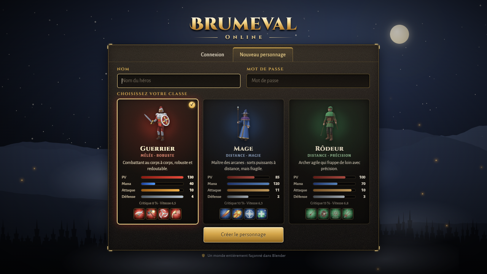
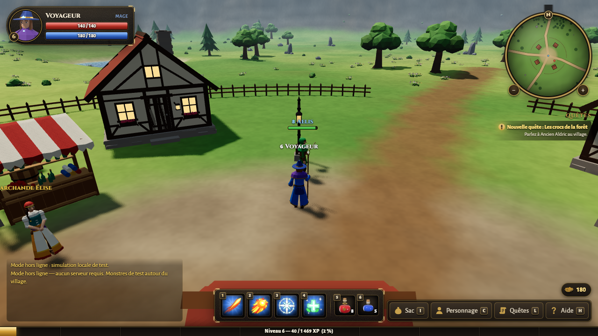
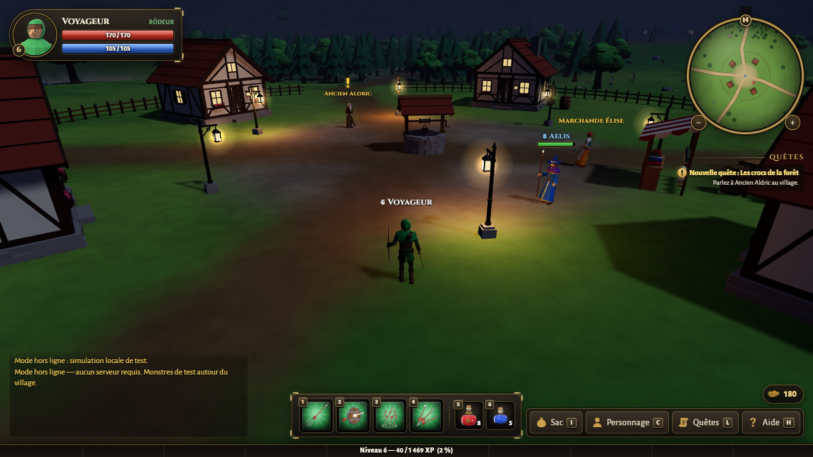
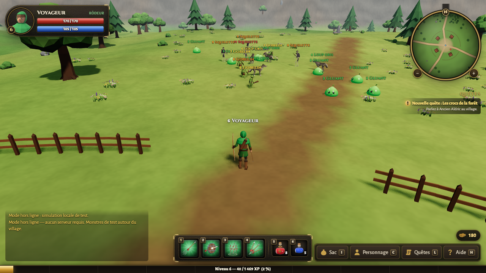
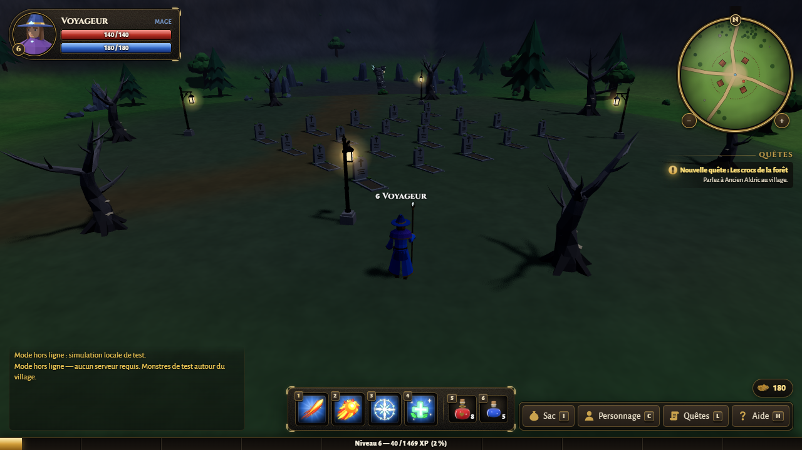
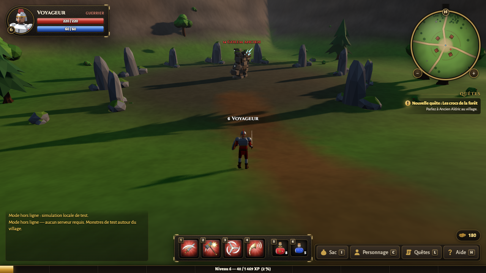
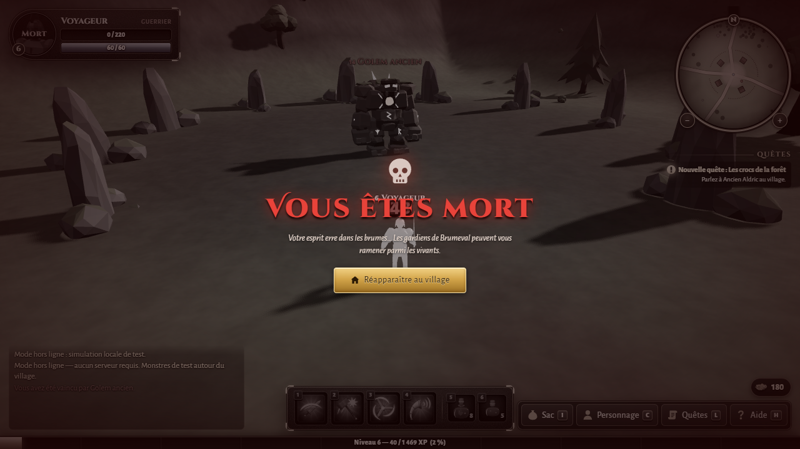

# Brumeval Online

**MMORPG multijoueur jouable dans le navigateur** : un serveur de jeu Node.js faisant autorité, un client
Three.js, et **tous les modèles 3D, animations et icônes générés par code avec Blender 5.0** (scripts Python
`bpy` exécutés en mode *headless*). Aucune texture ni aucun modèle téléchargé : tout le contenu visuel du jeu
est produit par les scripts de `assets/blender/`.



| | |
|---|---|
|  |  |
|  |  |
|  |  |

---

## Sommaire

1. [Présentation](#présentation)
2. [Fonctionnalités](#fonctionnalités)
3. [Démarrage rapide](#démarrage-rapide)
4. [Commandes npm](#commandes-npm)
5. [Contrôles](#contrôles)
6. [Structure du projet](#structure-du-projet)
7. [Architecture](#architecture)
8. [Le pipeline Blender](#le-pipeline-blender)
9. [Ajouter du contenu](#ajouter-du-contenu)
10. [Tests](#tests)
11. [Options de développement](#options-de-développement)
12. [Dépannage](#dépannage)

---

## Présentation

Les brumes se lèvent sur la vallée de **Brumeval**. Au centre, un village paisible protégé par sa palissade ;
tout autour, des terres infestées de créatures. L'**Ancien Aldric** cherche des héros, et la **Marchande
Élise** vend potions, armes et armures à qui peut payer.

Créez un **Guerrier**, un **Mage** ou un **Rôdeur**, retrouvez les autres joueurs connectés, combattez
ensemble, montez jusqu'au niveau 20 et venez à bout du **Golem ancien** qui s'est réveillé au-delà du
cimetière. Tout le texte du jeu est en français.

## Fonctionnalités

**Monde**
- Une zone ouverte de 360 × 360 m : le village sûr de Brumeval (maisons à colombages, puits, étal, lanternes,
  palissade), des routes de terre, les Plaines d'Émeraude, la Prairie du Sud, la Forêt des Murmures, le camp
  gobelin, le Cimetière oublié et l'Antre du Golem, des lacs et une ceinture de montagnes.
- Environ 960 objets de décor (arbres, rochers, buissons, fleurs, clôtures, tentes, tombes…) rendus par
  instanciation, avec collisions partagées entre client et serveur.
- **Cycle jour/nuit** de 20 minutes synchronisé par le serveur : soleil, lune, étoiles, nuages, brouillard,
  lanternes et feux de camp qui s'allument la nuit.

**Classes et combat**
- Trois classes avec chacune une attaque automatique et trois capacités (mana, temps de recharge, portée) :
  - **Guerrier** : Frappe, Coup puissant, Tourbillon, Cri de guerre.
  - **Mage** : Trait de feu, Boule de feu, Nova de givre (ralentit), Soin.
  - **Rôdeur** : Tir, Tir perçant, Pluie de flèches (zone ciblée), Tir rapide (3 flèches).
- Ciblage au clic ou avec Tab, projectiles avec temps de vol, effets de zone, coups critiques, ralentissement.
- Monstres avec IA : errance, agression, poursuite, attaque, retour au bercail (*leash*), réapparition.
  Menace : le monstre s'en prend à celui qui lui inflige le plus de dégâts.
- Boss : le **Golem ancien** frappe périodiquement le sol autour de lui.
- Aucun combat dans le village, pas de JcJ.

**Progression**
- Expérience et niveaux (jusqu'au niveau 20), statistiques qui évoluent avec le niveau et l'équipement.
- Butin directement dans le sac (24 emplacements), or, potions de soin et de mana.
- Emplacements d'arme et d'armure avec restrictions de classe et de niveau.
- Marchande : achat, et revente par clic droit dans le sac.
- Une chaîne de **5 quêtes** de l'Ancien Aldric (gluants, loups, gobelins, squelettes, golem) avec
  récompenses, dont une arme légendaire propre à chaque classe.
- Mort et réapparition au village ; toute la progression est sauvegardée côté serveur.

**Social**
- Discussion générale, chuchotements (`/w`), réponse rapide (`/r`), `/who`, `/help`.
- Noms et barres de vie au-dessus des personnages, nombre de joueurs en ligne, messages d'arrivée et de départ.

**Interface**
- Écran de connexion et de création de personnage avec portraits des classes, écran de chargement.
- Portrait, barres de vie et de mana, cadre de cible, barre d'expérience, barre d'action avec temps de
  recharge, emplacements de potions, suivi de quêtes, minicarte avec zoom.
- Fenêtres déplaçables : Sac, Personnage, Journal de quêtes, Aide. Dialogues des PNJ avec quêtes et boutique.
- Notifications, bannières de zone et de niveau, écran de mort, textes de combat flottants.
- Effets sonores synthétisés en direct (WebAudio), désactivables avec **M**.

## Démarrage rapide

### Prérequis

- **Node.js 22** ou plus récent (npm inclus).
- Un navigateur récent avec WebGL (Chrome, Edge, Firefox).
- **Blender 5.0** uniquement si vous voulez régénérer les modèles et les icônes : ils sont déjà fournis dans
  `client/public/`.

### Installation

```bash
npm install
```

### Mode développement

```bash
npm run dev
```

Cette commande lance le serveur de jeu sur le port **3000** (redémarrage automatique quand `server/src` ou
`shared` changent) et le serveur Vite sur le port **5173** (rechargement à chaud, `/ws` redirigé vers le
serveur de jeu).

Ouvrez **http://localhost:5173**, créez un personnage et jouez. Pour tester le multijoueur, ouvrez un
deuxième onglet et créez un autre personnage : chaque onglet est un joueur.

### Mode production

```bash
npm run build     # compile le client dans client/dist
npm start         # serveur de jeu + fichiers statiques sur http://localhost:3000
```

Variables d'environnement reconnues par `npm start` :

| Variable | Défaut | Rôle |
|---|---|---|
| `PORT` | `3000` | Port HTTP et WebSocket (`/ws`) |
| `DATA_DIR` | `server/data` | Dossier de sauvegarde des comptes (`accounts.json`) |
| `STATIC_DIR` | `client/dist` | Dossier du client compilé |

Les comptes sont enregistrés toutes les 10 secondes, à chaque déconnexion et à l'arrêt du serveur
(écriture atomique : fichier temporaire puis renommage). Les mots de passe sont hachés avec scrypt.

## Commandes npm

| Commande | Description |
|---|---|
| `npm install` | Installe les dépendances (espaces de travail `client` et `server`) |
| `npm run dev` | Serveur de jeu (:3000) et client Vite (:5173) |
| `npm run build` | Compile le client dans `client/dist` |
| `npm start` | Lance le serveur de production (:3000), qui sert aussi `client/dist` |
| `npm test` | Tests unitaires du serveur puis test de bout en bout multijoueur |
| `npm run assets` | Régénère tous les modèles 3D et toutes les icônes avec Blender |
| `npm run assets -- <groupe…> [--only k1,k2] [--no-preview]` | Régénère seulement certains groupes ou modèles |
| `npm run inspect -- client/public/models/*.glb` | Résumé des GLB : triangles, dimensions, os, animations |

## Contrôles

| Touche / souris | Action |
|---|---|
| **Z Q S D**, **W A S D** ou flèches | Se déplacer (les touches physiques sont utilisées : AZERTY et QWERTY fonctionnent) |
| Clic gauche | Sélectionner une cible ; parler à un PNJ (à moins de 5 m) |
| Clic droit sur un monstre | Le sélectionner et lancer l'attaque automatique |
| Clic maintenu + glisser | Faire pivoter la caméra |
| Clic gauche + clic droit maintenus | Courir tout droit |
| Molette | Zoomer / dézoomer (3 à 28 m) |
| **Tab** | Cibler l'ennemi suivant devant vous |
| **Échap** | Fermer la fenêtre du dessus, sinon annuler la cible |
| **1** | Attaque automatique de la classe |
| **2 3 4** | Capacités |
| **5** / **6** | Potion de soin (la meilleure disponible) / potion de mana |
| **I** / **C** / **L** / **H** | Sac / Personnage / Journal de quêtes / Aide |
| **Entrée** | Ouvrir la discussion, envoyer le message |
| **M** | Couper ou rétablir le son |
| **O** | Réglages graphiques (préréglages Bas / Moyen / Élevé / Ultra, voir [docs/RENDU.md](docs/RENDU.md)) |

Commandes de discussion : `/w nom message` (chuchoter), `/r message` (répondre au dernier chuchotement),
`/who` (joueurs en ligne), `/help` (aide).

Dans le sac : clic gauche pour utiliser ou équiper ; clic droit pour le menu (Utiliser / Équiper, Vendre quand
la boutique est ouverte, Jeter) ; Maj + clic droit pour vendre directement. Dans la fenêtre Personnage, un
clic sur l'arme ou l'armure la retire.

## Structure du projet

```
mmorpg/
├── shared/                 Contrat commun au serveur, au client et aux assets (modules ES sans dépendance)
│   ├── protocol.js         Tous les messages réseau, champs et constantes (tick, vue, portée…)
│   ├── data.js             Classes, capacités, monstres, objets, PNJ, quêtes, formules
│   ├── world.js            Relief, routes, lacs, régions, zones d'apparition, objets du décor
│   ├── collision.js        CollisionWorld : collisions cercle contre obstacles (client et serveur)
│   └── noise.js            Bruit et générateur aléatoire déterministes
├── server/                 Serveur de jeu Node.js (seule dépendance : ws)
│   ├── src/index.js        Point d'entrée, startServer()
│   ├── src/net.js          Sessions WebSocket, authentification, limites de débit
│   ├── src/game.js         Monde, boucle de simulation à 20 Hz
│   ├── src/snapshot.js     Instantanés par zone d'intérêt
│   ├── src/systems/        Combat, IA, PNJ, objets, joueurs, régénération
│   ├── src/…               Inventaire, quêtes, discussion, persistance, déplacement, authentification
│   ├── test/               Tests unitaires (node:test)
│   └── data/               Sauvegarde des comptes (créé au premier lancement, ignoré par git)
├── client/                 Client navigateur (Vite + three.js)
│   ├── index.html
│   ├── src/main.js         Démarrage, câblage réseau / rendu / interface, boucle de jeu
│   ├── src/net.js, state.js  Connexion WebSocket, état du joueur, entités, interpolation
│   ├── src/render/         Scène, ciel, terrain, eau, décor instancié, entités animées, effets, étiquettes
│   ├── src/game/           Joueur local, caméra, entrées clavier / souris, ciblage
│   ├── src/ui/             Interface HTML/CSS (connexion, HUD, fenêtres, dialogues, minicarte, discussion)
│   ├── src/offline/        Mode hors ligne (?offline=1) : petite simulation locale pour tester sans serveur
│   ├── src/audio.js        Effets sonores synthétisés
│   ├── ui-sandbox.html     Bac à sable de l'interface (pages de démonstration de chaque écran)
│   └── public/             models/*.glb, icons/*.png, ui/*.png : générés par Blender
├── assets/
│   ├── blender/common.py   Utilitaires bpy partagés : matériaux, export glTF, rendus d'aperçu et d'icônes
│   ├── blender/<groupe>/   Un script build.py par groupe : characters, creatures, nature, structures, icons
│   └── previews/           Rendus d'aperçu de chaque modèle (contrôle visuel)
├── scripts/
│   ├── dev.mjs             npm run dev
│   ├── build-assets.mjs    npm run assets
│   └── inspect-glb.mjs     npm run inspect
├── tests/
│   ├── bot.mjs             Test de bout en bout : deux bots jouent une partie complète
│   └── soak.mjs            Test de charge (20 bots)
├── docs/screenshots/       Captures d'écran
└── SPEC.md                 Spécification technique détaillée (en anglais)
```

## Architecture

- **Serveur faisant autorité.** Le serveur simule le monde à **20 Hz** : IA des monstres, combat, projectiles,
  régénération, quêtes, butin. Les clients n'envoient que des intentions (déplacement, capacité, discussion,
  achat…), que le serveur vérifie une à une (types, portée, mana, recharge, zone sûre, niveau, classe…).
- **Déplacements.** Le client simule son propre personnage avec le même `CollisionWorld` que le serveur, ce
  qui donne des déplacements instantanés. Le serveur valide chaque position (vitesse, terrain praticable,
  collisions) et renvoie une correction en cas d'écart, par exemple face à un *speed hack*.
- **Instantanés.** Dix fois par seconde, chaque client reçoit les entités situées à moins de 80 m ; les champs
  statiques (nom, modèle, niveau…) ne sont envoyés qu'à la première apparition ou quand ils changent. Le client
  affiche les autres entités avec 200 ms de retard et interpole leurs positions pour un mouvement fluide.
- **Protocole.** JSON sur WebSocket (`/ws`), entièrement décrit dans `shared/protocol.js`. Le serveur et le
  client importent les mêmes données de jeu (`shared/data.js`) et la même carte (`shared/world.js`).
- **Robustesse.** Charge utile limitée à 8 Ko, plus de 60 messages par seconde entraîne une déconnexion,
  chaque gestionnaire est isolé (une erreur ne fait jamais tomber le serveur), un compte ne peut être connecté
  qu'une fois.

## Le pipeline Blender

Tous les assets sont **générés par du code** : aucun fichier `.blend` n'est versionné et rien n'est
téléchargé. Chaque groupe possède un script `assets/blender/<groupe>/build.py` exécuté par Blender en mode
*headless* (sans interface) :

| Groupe | Contenu |
|---|---|
| `characters` | Guerrier, mage, rôdeur, Ancien Aldric, Marchande Élise, gobelin, squelette (squelette de 18 os commun, animations Idle / Walk / Attack / Cast / Hit / Death), et les portraits `client/public/ui/*.png` |
| `creatures` | Gluant, loup, Golem ancien (squelettes dédiés, animations avec étirement et écrasement) |
| `nature` | Pins, chênes, arbres morts, rochers, buissons, fleurs |
| `structures` | Maison, puits, clôture, lanterne, caisse, tonneau, feu de camp, tente, tombe, étal |
| `icons` | Les 21 icônes d'objets, l'icône d'or et les 12 icônes de capacités (128 × 128) |

Principe de chaque script : il part d'une scène vide (`--factory-startup`), construit la géométrie
low-poly (bmesh, primitives), crée des matériaux *Principled* simples (couleur, rugosité, métal, émission),
fabrique l'armature `Rig` et les animations image par image, puis exporte un GLB dans `client/public/models/`
et rend un aperçu dans `assets/previews/`. Les modèles regardent vers −Y dans Blender, ce que l'exportateur
glTF convertit en +Z, l'axe « avant » du client. Les constructions sont **déterministes** : relancer un script
redonne des fichiers identiques.

```bash
npm run assets                                   # tous les groupes (≈ 2 minutes)
npm run assets -- creatures                      # un seul groupe
npm run assets -- characters --only warrior,goblin --no-preview
npm run inspect -- client/public/models/*.glb    # vérifier triangles, dimensions, os et animations
```

Blender est cherché dans `C:\Program Files\Blender Foundation\Blender 5.0\blender.exe` sous Windows et dans le
`PATH` (`blender`) ailleurs ; la variable d'environnement `BLENDER` permet d'indiquer un autre chemin. On peut
aussi lancer un groupe directement :

```bash
"C:\Program Files\Blender Foundation\Blender 5.0\blender.exe" --background --factory-startup \
  --python-exit-code 1 --python assets/blender/nature/build.py -- --only bush --no-preview
```

**Pas besoin du serveur MCP Blender.** La génération passe uniquement par ces scripts `bpy` en ligne de
commande, ce qui la rend reproductible et automatisable. L'extension **Blender MCP** pourra servir plus tard
pour des retouches interactives (piloter Blender depuis un assistant IA, ajuster un modèle à l'œil) ; pensez
alors à reporter les modifications dans le script du groupe, sinon le prochain `npm run assets` les écrasera.

## Ajouter du contenu

Toutes les données de jeu sont dans `shared/` : le serveur, le client et l'interface les lisent directement.
Le serveur de développement redémarre tout seul quand `shared/` change.

### Un nouveau monstre

1. **Données** : ajoutez une entrée dans `MONSTERS` (`shared/data.js`) : nom français, `model` (clé du GLB),
   plage de niveaux, statistiques, portée d'agression, vitesse, XP, or et table de butin.
2. **Apparition** : ajoutez une zone dans `SPAWN_ZONES` (`shared/world.js`), et éventuellement une région
   nommée dans `REGIONS` pour la bannière de zone et la minicarte.
3. **Modèle** : écrivez une fonction de construction dans `assets/blender/characters/` (humanoïde : réutilisez
   le squelette de `humanoid.py` et déclarez-la dans `BUILDERS` de `build.py`) ou un module dans
   `assets/blender/creatures/` (ajoutez sa clé à `KEYS`). Animations attendues : `Idle`, `Walk`, `Attack`,
   `Hit`, `Death` à 24 images/s. Puis `npm run assets -- creatures --only <clé>`.
4. **Libellé de quête** (facultatif) : ajoutez le texte de progression dans `KILL_LABELS`
   (`server/src/quests.js`), par exemple « Araignées éliminées ».

Le client charge automatiquement `/models/<clé>.glb` pour chaque modèle référencé dans `shared/data.js` ; si
le fichier manque, une forme de remplacement colorée est affichée et le jeu reste jouable.

### Un nouvel objet

1. Ajoutez l'objet dans `ITEMS` (`shared/data.js`) : `type` (`consumable`, `weapon`, `armor` ou `junk`),
   `icon`, bonus (`atk`, `def`, `hp`, `mp`, `crit`, `heal`, `mana`), `cls`, `lvl`, `price`, `sell`, `rarity`.
2. Rendez-le disponible : dans la liste `shop` de la marchande (`NPCS.merchant`), dans les `drops` d'un
   monstre, ou en récompense de quête.
3. Ajoutez son icône dans `assets/blender/icons/items.py` (dictionnaire `BUILDERS`) puis lancez
   `npm run assets -- icons --only <icône>`. Le script vérifie `shared/data.js` et s'arrête avec une erreur
   claire si une icône n'a pas de fonction de construction.

### Une nouvelle quête

1. Ajoutez-la dans `QUESTS` (`shared/data.js`) : `name`, `giver`, `lvl`, `requires` (quête précédente ou
   `null`), `text`, `done`, `goal: { kill, count }`, `reward: { xp, gold, items, classItem? }`.
2. Ajoutez son identifiant dans la liste `quests` du PNJ donneur (`NPCS.elder.quests`).

Le dialogue, le journal de quêtes, le suivi à l'écran et les marqueurs « ! » / « ? » au-dessus du PNJ se
mettent à jour tout seuls.

## Tests

```bash
npm test
```

- **78 tests unitaires** (`server/test/*.test.js`) : formules, inventaire, validation des déplacements,
  quêtes, combat, authentification, persistance, HTTP, réseau.
- **Test de bout en bout** (`tests/bot.mjs`, environ 25 s) : le serveur démarre sur un port libre avec un
  dossier de données temporaire, deux bots créent leur compte, se voient, discutent et chuchotent ; le premier
  parle à l'Ancien, accepte la quête, achète une potion, marche jusqu'aux plaines à vitesse réelle, tue un
  gluant avec l'attaque automatique, gagne XP, or et progression de quête, se fait corriger en cas de
  *speed hack*, puis se reconnecte en retrouvant toute sa progression.
- **Test de charge** : `node tests/soak.mjs --bots 20 --seconds 20` affiche la durée des ticks et la charge
  CPU du serveur.

## Options de développement

Paramètres d'URL du client :

| Paramètre | Effet |
|---|---|
| `?autologin=Nom&cls=mage` | Se connecte automatiquement (mot de passe `test1234`) et crée le compte s'il n'existe pas |
| `?offline=1` | Mode hors ligne : simulation locale, sans serveur (options `cls`, `name`, `tod`, `mobs=N`, `at=x,z,angle`) |
| `?tod=0.9` | Fige l'heure affichée (0 minuit, 0,25 lever du soleil, 0,5 midi, 0,75 coucher) |
| `?quality=low` | Sans ombres, résolution réduite, pour les machines modestes |
| `?mute=1` | Sans son |

Dans la console du navigateur, `window.__game` donne accès à l'état du jeu, à la scène et au réseau
(`__game.stats()` affiche les appels de rendu et le nombre d'entités).

Le bac à sable de l'interface est disponible pendant `npm run dev` sur
http://localhost:5173/ui-sandbox.html.

## Dépannage

- **Le port 3000 ou 5173 est déjà utilisé** : arrêtez l'autre processus, ou lancez le serveur sur un autre
  port (`PORT=3100 npm start`).
- **`npm run assets` ne trouve pas Blender** : indiquez son chemin, par exemple
  `BLENDER="D:\Blender\blender.exe" npm run assets` (PowerShell : `$env:BLENDER="…"; npm run assets`).
- **Écran noir ou message WebGL** : activez l'accélération matérielle du navigateur, ou essayez `?quality=low`.
- **Repartir de zéro** : arrêtez le serveur et supprimez `server/data/accounts.json`.
- **Polices différentes** : l'interface utilise des polices Google Fonts ; hors connexion, des polices système
  les remplacent automatiquement.
