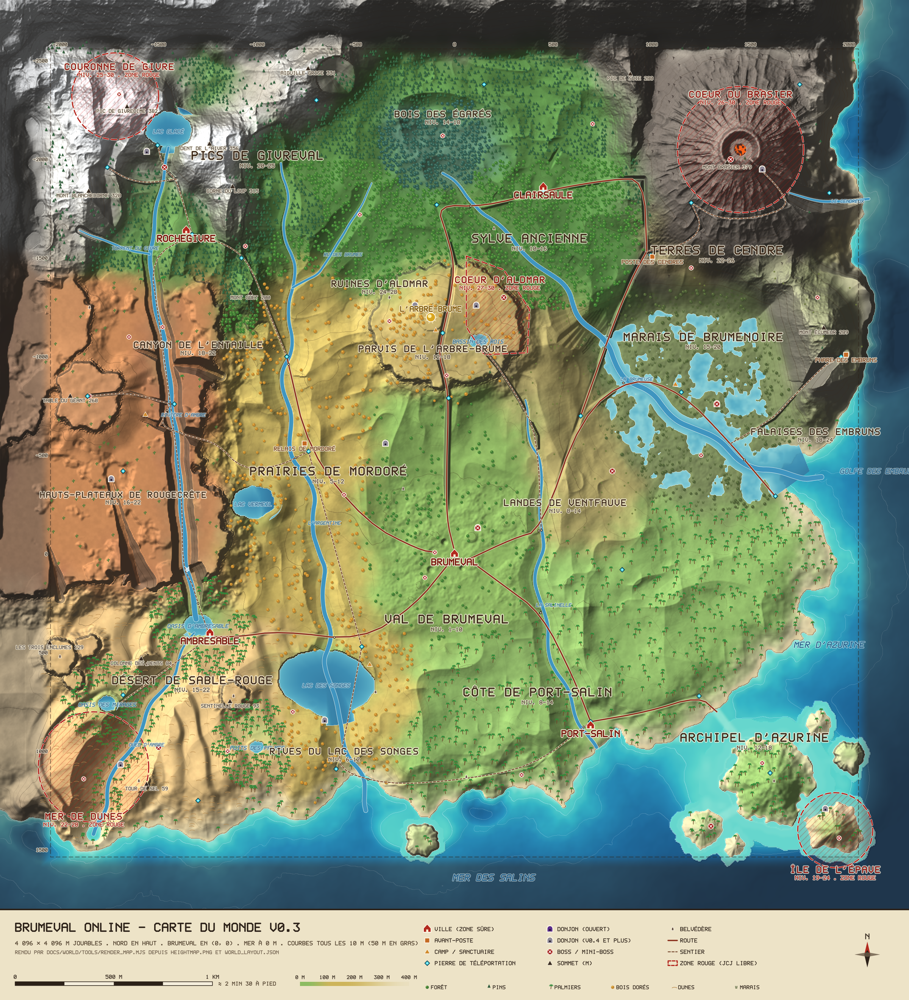

# Brumeval Online — le monde ouvert v0.3

> Conception finale du monde (concepteur principal), issue des quatre brouillons de `docs/world/drafts/`
> (cartographe, architecte technique, contenu, direction artistique). **Les données font foi** :
> `world_layout.json` (tout ce qui est placé), `heightmap.png` (le relief), `carte_monde.png` (la carte rendue).
> Ce document les explique ; en cas d'écart, régénérer les données puis corriger le texte.
>
> Documents associés : [`TECH_MONDE.md`](TECH_MONDE.md) (moteur : diffusion, cuisson, serveur, nuages, océan,
> budgets) · [`ASSETS_MONDE.md`](ASSETS_MONDE.md) (assets par biome, propriétaires, clés) · `drafts/` (archives).



---

## 0. Fichiers, outils et schéma de `world_layout.json`

### 0.1 Fichiers

| Fichier | Rôle | Produit par |
|---|---|---|
| `heightmap.png` + `heightmap.json` | relief : PNG 16 bits en niveaux de gris, 1 025 × 1 025 échantillons, **4,5 m** entre échantillons, couvre x −2 304…2 304 et z −2 808…1 800 (4 608 m). Décodage `h = valeur × 0,01 − 60` (m). Ligne 0 = nord. | `tools/gen_world.mjs` (déterministe, graine 7331) |
| `tools/out/carto.json` | mesures du générateur (régions, lacs, rivières, routes, temps de trajet, carte de contrôle) | `tools/gen_world.mjs` |
| `world_layout.json` | **fichier unique à consommer** : cadre, typologie des hauteurs, biomes, régions, villes, pierres, donjons, lieux, routes, rivières, lacs, côtes, zones rouges, bestiaire, trame, carte de contrôle | `tools/build_layout.mjs` (carto.json + `tools/content_spec.mjs`) |
| `carte_monde.png` | carte illustrée 2 400 × 2 640 px (1,92 m/px) | `tools/render_map.mjs` |
| `tools/out/validate_report.json` | rapport de contrôle (références, chevauchements, courbe de niveaux, temps de trajet) | `tools/validate.mjs` |

Régénération complète (racine du dépôt, Node 22, aucune dépendance) :

```bash
node docs/world/tools/gen_world.mjs --no-render   # relief + carto.json (≈ 40 s ; sortie identique octet pour octet)
node docs/world/tools/build_layout.mjs            # world_layout.json
node docs/world/tools/validate.mjs                # code de sortie 1 s'il reste une erreur
node docs/world/tools/render_map.mjs              # carte_monde.png (≈ 10 s) ; --grid ajoute une grille de relecture
node docs/world/tools/validate.mjs --probe "x,z;x,z"   # sonde : région, altitude, eau, pente, temps depuis Brumeval
node docs/world/tools/probe.mjs x z [demi-largeur] [pas] # grille d'altitudes autour d'un point
```

Qui modifie quoi : le **relief** se change dans `tools/world_spec.mjs` (ancres, crêtes, sommets, lacs, rivières, routes,
villes, pierres, donjons, formes des régions) ; le **contenu** (monstres, boss, lieux, camps, services, météo, trame,
ouverture des régions) dans `tools/content_spec.mjs`. Ne jamais éditer `world_layout.json` à la main.

### 0.2 Repère

x vers l'**est**, z vers le **sud** (le nord est −z, en haut de la carte), y vers le haut, 1 unité = 1 m, mer à 0 m.
**Brumeval reste en (0, 0)** : mêmes conventions que `shared/world.js`, aucune conversion des positions enregistrées.

### 0.3 Schéma (`"schema": "brumeval.world_layout/1"`)

| Clé | Type | Contenu |
|---|---|---|
| `frame` | objet | `grid {size, step, x0, z0, x1, z1}`, `playable {x0: −2048, x1: 2048, z0: −2560, z1: 1536}`, `seaLevel: 0`, `brumeval: [0, 0]`, `heightmap`, `heightmapMeta` (copie de `heightmap.json`, dont la règle de raccord `legacy`) |
| `heightTypology` | objet | `bands[]` (étages E0–E7 : `id, name, min, max, ground, play, color`), `vegetationLimits`, `slopeClasses[]` (`id, maxDeg, effect, render`), `walkableMaxDeg: 40`, `wadeMaxDepth: 0.8`, `reliefTypes[]` (`id, key, name, shape`), `slopeHistogramPlayableLand` |
| `biomes` | `{lettre: {name, color, grass}}` | 20 biomes ; la lettre est celle de `controlMap.biome` |
| `regions[]` | objets | `id, char, name, biome, biomeName, levels [min, max], danger (vert/jaune/rouge), tier (T1–T6), version, opening (v0.3.0 / v0.3.1 / v0.4), closedBy?, shape {polygon: [[x,z]…]} ou {circle: [x, z, r]}, bbox, areaKm2, landKm2, relief[] {id, key}, heightTypology {mainBand, bandsPct, slopePct, elevation {min, mean, max, p5, median, p95}}, walkableLandPct, weather[] {kind, weight}, ambiance, monsters[] {key, levels, note?}, miniBosses[] {name, model, lvl, x, z, desc}, bosses[] {key, name, lvl, x, z, desc}, harvest[], brumillons, landmarks[]` |
| `redZones[]` | objets | `id, name, levels, tier, shape, version, rules` (règles ROADMAP §2 bis) |
| `safeZones[]` | objets | `id, kind (ville/sanctuaire), circle [x, z, r]` |
| `towns[]`, `outposts[]`, `camps[]` | objets | `id, name, kind, x, z, y, safeRadius?, danger?, region, services[], version, codex?`, camps : `onWater?`, `note?` |
| `landmarks[]` | objets | repères uniques (l'Arbre-Brume) : `id, name, x, z, y, note` |
| `waypoints[]` | objets | pierres de téléportation : `id, name, x, z, y, region` |
| `dungeons[]` | objets | `id, name, x, z, y, region, kind (instance / arène ouverte), levels, boss, version, kit, note?` |
| `pois[]` | objets | lieux nommés : `id, region, type (belvedere, ruine, repere, sanctuaire, camp_monstres, grotte, cascade, pont, arene, epave, stele, source), name, x, z, y, version, desc, access?, bake?` |
| `roads[]` | objets | `id, name, cls (main/trail), grade, maxCut, maxFill, pts [[x,z]…], length, maxGradePct, bridges [[x,z]…]` |
| `rivers[]` | objets | `id, name, type, width, depth, wadeable, length, source [x,z,h], mouth [x,z,h], surfaceProfile [[x,z,niveau d'eau]…]` (décroissant de la source à l'embouchure) |
| `lakes[]`, `waterfalls[]`, `wetland`, `coast` | objets | lacs (ellipse `x, z, rx, rz, level, depth, lava`), cascades (`top, bottom`), marais (`poly, level`), côte (`landPolygon, cliffs, lagoons, islands, sandbars`) |
| `relief` | objet | `peaks[] {id, name, h, x, z}`, `passes[]`, `volcano`, `ranges[]`, `plateaus[]`, `mesas[]` |
| `monsters.new[]` | objets | nouveaux monstres : `key, name, archetype, levels, rig, version, idea` |
| `story[]`, `collectible`, `traversal[]` | objets | trame, Brumillons, déplacements par version |
| `travel` | objet | vitesses et temps de trajet mesurés entre villes |
| `controlMap` | objet | grille de **32 m** (144 × 144, lignes nord → sud, un caractère par case) : `biome`, `region` (→ `regions[].char`), `elev` (m), `water` (0 sec, 1 mer, 2 lagon, 3 lac, 4 rivière, 5 étang, 6 lave), `net` (masque : 1 route, 2 rivière, 4 pont) |

---

## 1. Vision

**Un monde qu'on voit avant d'y aller.** Du village de Brumeval, au centre-sud, on aperçoit l'Arbre-Brume doré sur
son plateau au nord, les falaises rouges à l'ouest, la mer turquoise au sud, et par temps clair les pics enneigés et
le panache du volcan. Chaque région a **une couleur, un relief et une silhouette** qu'on reconnaît à 1 km, comme sur
la carte de référence ; la matière et la lumière restent celles d'*Elden Ring* (PBR cuit, brume, lumière
volumétrique), avec la variété et les biomes lumineux de *Zelda* et l'herbe et les arbres qui bougent au vent.

Le monde descend du **nord-ouest froid et haut** vers le **sud-est bas et tropical** :

| Côté | Ce qu'on y trouve |
|---|---|
| **Sud-ouest (en bas à gauche)** | le **désert de Sable-Rouge** : dunes, palmiers, oasis turquoise, la ville d'**Ambresable** au pied de chutes de 53 m, la Mer de Dunes contre l'océan |
| **Ouest** | les **Hauts-Plateaux de Rougecrête** (terrasses de roche rouge, mesas) fendus par le **Canyon de l'Entaille** |
| **Centre** | le **Val de Brumeval** (départ), les **Prairies de Mordoré** dorées, le **Lac des Songes**, les **Landes de Ventfauve** |
| **Centre-nord** | le **plateau d'Aldmar** (ruines, zone rouge au cœur) et l'**Arbre-Brume** |
| **Nord** | la **Sylve Ancienne**, avec la cuvette brumeuse du **Bois des Égarés** |
| **Nord-ouest** | les **Pics de Givreval** (neige, Lac Glacé, Rochegivre, la Couronne de Givre) |
| **Nord-est** | le volcan **Mont Brasier** et les **Terres de Cendre** (v0.4) |
| **Est** | le **Marais de Brumenoire** et les **Falaises des Embruns** |
| **Sud et sud-est** | la mer : **Côte de Port-Salin** (plages, lagons), **Archipel d'Azurine** (7 îles, bancs de sable) |

### Ce qu'on retient des images de référence (rien n'est copié dans le dépôt, aucun nom repris)

| Réf. | On retient | Chez nous |
|---|---|---|
| 1 carte du monde | une quinzaine de régions lisibles de loin, désert et hauts plateaux au sud-ouest, plaines au centre, forêt au nord, volcan au nord-est, neige au nord-ouest, marais à l'est, mer au sud et à l'est, rivières jusqu'à la mer, château au centre | toute la disposition ; Aldmar au centre |
| 2 prairie, ruines, grand monstre | un géant endormi au milieu d'un champ ouvert, qu'on choisit de réveiller | Colosse des Stèles (Ventfauve) |
| 3 prairie dorée d'automne | herbes hautes dorées, arbres roux, grands ciels | Prairies de Mordoré, Parvis de l'Arbre-Brume |
| 4 ruines dorées et pierre lumineuse | stèle qui luit = aimant visuel qui raconte l'histoire | stèles d'Aldmar aux runes cyan |
| 5 ville du désert, palmiers, cascades | de l'eau qui tombe au milieu du sable | Ambresable et les Chutes d'Ambresable |
| 6 char à voile sur les dunes | un déplacement propre au biome | char à sable (v0.4) |
| 7 bois perdus dans la brume | suivre des lanternes sous peine d'être ramené au départ | Bois des Égarés |
| 8 forêt luxuriante, rayons | cathédrale d'arbres, rayons dans la brume verte | Sylve Ancienne |
| 9, 10 plages tropicales | eau turquoise selon la profondeur, sable clair, palmiers, îles à gué | Port-Salin, Archipel d'Azurine |

---

## 2. Taille, repère et arbitrages

| Sujet | Décision finale | Arbitrage |
|---|---|---|
| Taille | **4 096 × 4 096 m jouables** (x −2 048…2 048, z −2 560…1 536), 16,8 km², ≈ 130 × la carte actuelle ; la carte des hauteurs couvre 4 608 m (256 m de mer au sud et à l'est, murailles de montagnes au nord et à l'ouest) | tous les brouillons d'accord ; remplace les 800 m de l'ancienne cible |
| Extension | 8 × 8 km plus tard en ajoutant des tuiles au-delà des murailles et au large (îles lointaines) | moteur prévu pour 8 192 m (TECH_MONDE §1) |
| Brumeval | reste en **(0, 0)** ; l'ancien carré de 360 m est incrusté aux mêmes x/z | — |
| Relèvement de l'ancienne carte | **+45 m** (village à 46,2 m, anciens lacs à 43,8 m) | carto (+45) retenu contre tech (+32) : la Salinelle et la route de Port-Salin ont une pente naturelle jusqu'à la mer |
| Raccord | `w = 1 − smoothstep(170, 450, max(|x|, |z|, 0,8·√(x²+z²)))` ; `h = lerp(carte, ancienne + 45, w)` ; w ≥ 0,99 dans |x|, |z| ≤ 160 | fondu large et arrondi (carto) : un fondu de 60 m laissait un carré visible |
| Grille du relief | source 4,5 m (1 025²) ; le moteur en tire des tuiles 2 m (détail ajouté) et une carte globale 8 m | carto retenu ; la grille 4 m / 4 096 m du brouillon tech est abandonnée (pas de rééchantillonnage à faire) |
| Codage des hauteurs | `h = u16 × 0,01 − 60` partout (source, tuiles, serveur) : −60…595 m au centimètre | unifie les deux brouillons (tech proposait 1/64 m) |
| Pente marchable | **40°** (au-delà, montée refusée par le serveur) | carto (40°) retenu : c'est la valeur qui a servi aux contrôles d'accès |
| Gué | eau ≤ **0,8 m** (vitesse × 0,6) ; pas de nage en v0.3 | — |
| Sommet | 405 m jouables (Pic de Givrecime), murailles de décor jusqu'à 574 m | sous les 600 m conseillés |

Échelle de marche (course 6,5 m/s) : traverser la carte ≈ **10 min 30**, au sprint ≈ 7 min 15, à cheval (v0.4)
≈ 5 min. Brumeval → Port-Salin 3,2 min · → Ambresable 3,9 min · → Clairsaule 6,3 min · → Rochegivre 6,7 min ;
le trajet le plus long entre deux villes est Port-Salin → Rochegivre, 10 min (mesuré par `validate.mjs` sur la carte).

---

## 3. Typologie des hauteurs

Demande de l'utilisateur : « que le cartographe fasse la typologie des hauteurs ». Les étages ci-dessous sont
**mesurés** sur `heightmap.png` (le cartographe fait foi ; les grilles proposées par tech, contenu et art sont
recalées dessus). `world_layout.json → heightTypology` et `regions[].heightTypology` donnent les chiffres exacts.

### 3.1 Étages d'altitude

| Étage | Altitude | Terrain | Jeu | Régions typiques (étage principal mesuré) |
|---|---|---|---|---|
| **E0** Fonds marins | −60 … −3 m | sable immergé, herbiers, récifs | non praticable (pas de nage en v0.3) | lagons, large |
| **E1** Rivage | −3 … 5 m | plages, lagons, vasières, étangs du marais | gués ≤ 0,8 m, bancs de sable, pontons | Brumenoire (40 %), Azurine, Épave |
| **E2** Basses terres | 5 … 40 m | prairies côtières, marais, désert bas, bords de lacs | grandes lignes de vue, routes | Port-Salin, Songes, Azurine, Brumenoire, Mer de Dunes |
| **E3** Terres moyennes | 40 … 90 m | Val de Brumeval (46 m), prairies dorées, landes, dunes hautes | l'essentiel du jeu : herbe au vent, camps, arènes | Val, Mordoré, Ventfauve, Sable-Rouge |
| **E4** Hautes terres | 90 … 160 m | Sylve, Bois des Égarés, plateau d'Aldmar, mesas | forêts, ruines, premiers belvédères | Sylve, Égarés, Aldmar, Parvis |
| **E5** Plateaux | 160 … 260 m | Rougecrête (190 / 232 m), Rochegivre (201 m), Table du Géant | belvédères qui révèlent la carte ; vol plané (v0.5) | Rougecrête, Entaille, Givreval, Cendres, Embruns |
| **E6** Montagne | 260 … 400 m | Pics de Givreval, cône du Mont Brasier, Mont Écumeur | cols, sentiers balisés, froid et chaleur | Couronne, Cœur du Brasier |
| **E7** Cimes et murailles | 400 … 620 m | Pic de Givrecime (≈ 405 m), Murailles du Nord (décor) | hors jeu sauf la cime de Givrecime | — |

Limites de végétation : arbres jusqu'à 212 m à Givreval, 200 m dans la Sylve, 150 m aux Cendres, 300 m ailleurs ;
neige permanente au-dessus de 262 m au nord-ouest seulement. Au-dessus de 48° : roche nue (rouge à l'ouest).

### 3.2 Classes de pente (appliquées par le moteur partout)

| Pente | Classe | Effet | Rendu | Part des terres jouables |
|---|---|---|---|---|
| 0–12° | plat | constructible : villes, camps, arènes | herbe pleine | 54 % (< 10°) |
| 12–25° | marchable | normal | herbe moins dense au-dessus de 20° | |
| 25–40° | raide | montée × 0,75 | terre, éboulis, herbe clairsemée | |
| 40–55° | glissade | montée refusée par le serveur, on glisse en descendant | roche triplanaire | 13 % au-delà de 40° |
| > 55° | falaise | mur | roche + modèles `cliff_*` posés à la cuisson | |

### 3.3 Types de relief (canal « relief » de la carte de contrôle)

`plaine` (ondulations 2–6 m) · `collines` (15–45 m) · `plateau` (dessus plat, bord de 20–60 m, terrasses de 11 m à
l'ouest) · `mesa` (tables isolées) · `canyon` (60–80 m, fond plat, parois à 66°) · `alpin` (crêtes vives, cirques)
· `volcan` (cône concave, cratère de 62 m, brèche de coulée) · `dunes` (crêtes NNE–SSO de 8–18 m, 25–40 m dans la
Mer de Dunes) · `marais` (plat à 4 m, 45 % d'étangs) · `cote_falaise` (60–100 m) · `cote_basse` (plages à 3 %,
lagons de 0,4–3 m, îlots, bancs de sable) · `foret_brume` (cuvette fermée de 25 m où la brume stagne) ·
`ancienne_carte` (relief v0.1/v0.2 relevé de 45 m, sans érosion) · `cuvette_lac` (pente douce vers un lac).

### 3.4 Règles de jeu liées à la hauteur

- **Belvédères** (POI `belvedere`, surtout en E4–E6) : les atteindre révèle la région sur la carte (brouillard de
  guerre, TECH_MONDE §9).
- **Froid** au-dessus de 300 m à Givreval et **chaleur** près de la lave : crochets de météo (TECH_MONDE §8), effets
  décidés avec le gameplay (v0.3.1).
- **Vol plané** (v0.5) depuis E5 et plus : les sommets de mesa (Trois Enclumes, Sentinelle Rouge) sont prévus pour ça
  et restent inaccessibles à pied en v0.3 (vus de loin).
- **Combat lisible** : jamais plus de 120 m de dénivelé sur 200 m en zone de combat ; les arènes de boss sont en
  classe « plat » (deux replats restent à tailler à la cuisson, §12).

---

## 4. Les régions

22 régions : **17 jaunes** et **5 rouges** (ROADMAP §2 bis : JcJ libre, sac de butin 10 min, +50 % XP, +100 %
butin, 5 s de protection à l'entrée). Aucune région verte hors des villes (zones sûres = cercles `safeZones`).
Surface = terres émergées ; altitude = médiane (p5–p95) mesurée.

### 4.1 Tableau d'ensemble

| Région | Biome | Niv. | Palier | Danger | Ouverture | km² | Altitude (m) | Ville / camp | Pierres | Brumillons |
|---|---|---:|---|---|---|---:|---|---|---:|---:|
| Val de Brumeval | prés verts | 1–10 | T1–T3 | jaune | v0.3.0 (existe) | 0,95 | 48 (43–78) | **Brumeval** | 1 | 14 |
| Prairies de Mordoré | prairie dorée | 5–12 | T1–T2 | jaune | v0.3.0 | 1,24 | 77 (34–131) | Relais de Mordoré | 2 | 14 |
| Rives du Lac des Songes | prairie dorée, lac | 6–12 | T2 | jaune | v0.3.0 | 0,44 | 29 (4–40) | Hameau des Saules | 2 | 10 |
| Landes de Ventfauve | lande dorée | 8–14 | T2 | jaune | v0.3.0 | 0,50 | 49 (16–85) | — | 1 | 10 |
| Côte de Port-Salin | côte tropicale | 8–14 | T2 | jaune | v0.3.0 | 1,38 | 31 (5–45) | **Port-Salin** | 3 | 12 |
| Sylve Ancienne | forêt ancienne | 10–16 | T2–T3 | jaune | v0.3.0 | 1,74 | 117 (77–195) | **Clairsaule** | 4 | 16 |
| Parvis de l'Arbre-Brume | ruines dorées | 12–18 | T3 | jaune | v0.3.0 | 0,17 | 159 (96–178) | Sanctuaire de la Veilleuse, Camp des Grandes Portes | 2 | 6 |
| Archipel d'Azurine | côte tropicale, îles | 12–18 | T3 | jaune | v0.3.1 | 0,87 | 16 (2–32) | — | 1 | 16 |
| Bois des Égarés | bois perdus (brume) | 14–18 | T3 | jaune | v0.3.0 | 0,21 | 104 (93–117) | — | 0 | 16 |
| Marais de Brumenoire | marais | 15–20 | T4 | jaune | v0.3.0 | 0,67 | 5 (4–44) | Pilotis de Brumenoire | 2 | 12 |
| Désert de Sable-Rouge | dunes, mesas, oasis | 15–22 | T4 | jaune | v0.3.0 | 1,17 | 41 (6–93) | **Ambresable** | 3 | 16 |
| Hauts-Plateaux de Rougecrête | roche rouge, mesas | 16–22 | T4 | jaune | v0.3.1 | 1,12 | 187 (114–258) | Fort du Couchant | 2 | 14 |
| Canyon de l'Entaille | canyon | 18–22 | T4 | jaune | v0.3.1 | 0,20 | 167 (114–188) | — | 1 | 10 |
| Falaises des Embruns | lande côtière, falaises | 18–24 | T4–T5 | jaune | **v0.3.0** | 0,34 | 144 (10–256) | Phare des Embruns | 1 | 10 |
| Pics de Givreval | neige et glace | 20–25 | T5 | jaune | v0.3.1 | 1,27 | 227 (152–328) | **Rochegivre** | 4 | 16 |
| Terres de Cendre | cendres volcaniques | 22–26 | T5–T6 | jaune | v0.4 | 0,93 | 193 (39–252) | Poste des Cendres | 4 | 12 |
| Ruines d'Aldmar | ruines dorées | 24–28 | T6 | jaune | v0.3.0 | 0,18 | 149 (92–161) | — | 0 | 8 |
| Île de l'Épave | côte tropicale | 19–24 | T5 | **rouge** | v0.3.1 | 0,05 | 14 (2–41) | — | 0 | 4 |
| Mer de Dunes | dunes géantes | 22–28 | T6 | **rouge** | v0.3.0 | 0,22 | 37 (5–71) | — | 0 | 6 |
| Couronne de Givre | neige, glacier | 25–30 | T6 | **rouge** | v0.3.1 | 0,15 | 350 (244–378) | — | 0 | 6 |
| Cœur du Brasier | cratère | 26–30 | T6 | **rouge** | v0.4 | 0,32 | 302 (249–368) | — | 0 | 6 |
| Cœur d'Aldmar | ruines, arène | 27–30 | T6 | **rouge** | v0.3.0 | 0,12 | 149 (102–157) | — | 0 | 6 |

Villes en gras (zone sûre, pierre, banque ou auberge) ; total 240 Brumillons, 33 pierres, 90 lieux nommés, 11 donjons.

### 4.2 Fiches

Pour chaque région : **ambiance** (réglage de lumière/brouillard pour `render-souls`), **météo** pondérée, monstres
(clés de `shared/data.js` ou nouvelles, §4.3), mini-boss et boss (avec leurs coordonnées dans le JSON), lieux,
récolte. Palettes détaillées : ASSETS_MONDE §2.

**Val de Brumeval** (niv. 1–10, départ, l'ancienne carte) — collines vertes, herbe haute en vagues, brume dorée au
lever du soleil, l'Arbre-Brume au nord sur son plateau. Météo clair 5 / brume 3 / pluie 2.
Monstres : gluant 1–3, loup 3–6, sanglier 4–7, gobelin 5–8, chaman gobelin 6–8, araignée 6–9 (Forêt des Murmures),
squelette 8–11 (Cimetière oublié). Mini-boss : Gluant-Roi (4, se divise), Chef Gorgrat (9, sonne le cor). Boss :
**Golem ancien** (14, inchangé, premier jalon). Lieux : village, camp gobelin, cimetière, Forêt des Murmures (tous
aux mêmes x/z qu'aujourd'hui), Moulin des Trois-Ailes, Tour de guet du Val (premier belvédère), Stèle d'Éveil, Mine de
Cuivrefond (donjon v0.4). Récolte : cuivre, herbe de brume.

**Prairies de Mordoré** (5–12) — prairie dorée d'automne perpétuel, grands ciels, vues de 1–2 km vers les falaises
rouges ; Lac Vermeil retenu par une digue. Clair 6 / nuageux 2 / orage 2. Sanglier, loup, brigand, archer brigand,
gluant doré. Mini-boss : Vieille-Hure (10). Lieux : Cercle des Sept Menhirs (énigme des ombres à midi), Meules des
Brigands, Digue du Lac Vermeil, Mont Guet (200 m, belvédère). Relais de Mordoré (marchand, feu, écurie v0.4).

**Rives du Lac des Songes** (6–12) — lac calme qui reflète le ciel, saules, roseaux, plages de l'Anse. Clair 5 /
brume 3 / pluie 2. Gluant d'eau, araignée, brigand, Crabe-Rocher. Mini-boss : La Tisseuse des Saules (12).
Lieux : Ponton des Brumes, Anse des Songes, Temple englouti (donjon v0.4). Hameau des Saules (alchimie).

**Landes de Ventfauve** (8–14) — lande dorée battue par le vent, stèles noires qui luisent la nuit, **colosse
endormi** au milieu du champ (réf. 2). Clair 5 / nuageux 3 / orage 2. Squelettes, archers squelettes, spectres la
nuit, sanglier. Boss : **Colosse des Stèles** (troll, 15, arène ouverte : on choisit de le réveiller). Lieux : Grande
Stèle d'Aldmar (chapitre III), Caveau aux Braseros, pied de la Rampe de l'Est.

**Côte de Port-Salin** (8–14) — sable blanc crème, eau turquoise, falaises blanches à l'ouest, lanternes du port.
Clair 6 / nuageux 2 / pluie 1 / orage 1. Crabe-Rocher, Pillard des Salins, contrebandiers, sanglier. Mini-boss :
Capitaine Sel-Amer (14). **Port-Salin** (CX-5) : forge, alchimie, couture, étals, banque, auberge, capitainerie.
Lieux : Falaises Blanches, Crique des Contrebandiers, Embouchure de la Salinelle, Tour du Guet côtier, Plage des Palmes.

**Sylve Ancienne** (10–16) — cathédrale d'arbres géants, rayons dans une brume verte, fougères (réf. 8). Clair 4 /
brume 3 / pluie 3. Loup, araignée, sanglier, gobelin, chaman. Mini-boss : Croc-Pâle (13, meute), La Tisseuse (16).
**Clairsaule** (hameau forestier : couture, alchimie, auberge). Lieux : Souche du Géant, Source aux Lucioles, deux
arènes. Récolte : cuivre, fer, herbe de brume, champignon de brume.

**Parvis de l'Arbre-Brume** (12–18) — brume dorée au sol, feuillage or-argent, pollen lumineux, Grand Escalier de
la Voie Royale. Clair 6 / brume 4. Squelettes, archers, spectres la nuit. Mini-boss : Le Porte-Bannière (17).
**L'Arbre-Brume** (CX-10, ≈ 120 m, cime vers 300 m, visible de partout), Sanctuaire de la Veilleuse (zone sûre,
échange des Brumillons), Camp des Grandes Portes, Racines de l'Arbre-Brume (donjon v0.4).

**Ruines d'Aldmar** (24–28) — anneau de ruines sur le plateau (falaises de 50 m, 3 accès), herbe dorée, remparts
effondrés, pierres dressées aux runes cyan. Clair 5 / brume 3 / orage 2. Chevaliers squelettes, archers, spectres,
Gardiens de grès. Mini-boss : Sénéchal Vorn (28). Lieux : Remparts du Couchant, Tour Brisée, Porte de l'Est, Bassin
des Rois. *Voir §10 : le saut de niveau avec le Val est voulu.*

**Cœur d'Aldmar** (27–30, **rouge**) — filtre de zone rouge (désaturation, brouillard rouille, braseros, bannières).
Élites squelettes, spectres, troll, Gardien de grès. Boss : **Champion écarlate** (30, Arène Écarlate). Grandes Portes
(fermées par 4 Sceaux), Crypte d'Aldmar (donjon v0.4, Roi-Liche).

**Bois des Égarés** (14–18) — cuvette de brume bleu-vert (vue 25–40 m), arbres morts noueux, lanternes à suivre
sinon on revient à l'entrée (réf. 7). Brume 7 / pluie 2 / clair 1. Spectres, araignées, loups de brume, Écorcier et
Feu-Brume (v0.4). Mini-boss : La Dame Grise (18). Lieux : Sentier des Lanternes, Cœur de la Brume (chapitre III).

**Marais de Brumenoire** (15–20) — eau sombre et verdâtre, pontons, saules, lanternes vertes, lucioles. Brume 5 /
pluie 3 / orage 2. Rôdeur des marais, araignée, spectre, chamans vasards, Crapaud-buffle (v0.4). Mini-boss : Le Noyeur
(18). Boss : **Sorcière des marais** (20, **Sceau de Vase**, Antre ouverte v0.3). Pilotis de Brumenoire (village sur
pilotis, alchimie, guérisseuse). Lieux : Mares aux Feux, Passerelles effondrées, Fosse du Noyeur, Delta de la Brumeuse.

**Désert de Sable-Rouge** (15–22, **en bas à gauche**) — dunes ocre, **palmiers**, oasis turquoise, chutes fines au
pied des falaises rouges, chaleur qui ondule (réf. 5–6). Clair 6 / tempête de sable 3 / nuageux 1. Scorpion,
Pillard des dunes, Dessiccé, Varan des failles. Mini-boss : Scorpion-Empereur (20). Boss : **Ver des sables** (21,
**Sceau d'Ambre**, Creux du Ver). **Ambresable** (ville-oasis, CX-13 proposé) : forge, alchimie, étals, banque,
auberge, loueur de chars (v0.4). Lieux : Oasis des Mirages, Puits des Palmes, Colonne des Vents, Temple aux Miroirs,
Palais-Mirage (visible seulement à midi), mesas des Trois Enclumes et de la Sentinelle Rouge (vues de loin).

**Mer de Dunes** (22–28, **rouge**) — dunes géantes de 25–40 m contre l'océan, squelette du Grand Ver. Tempête de
sable 5 / clair 5. Élites Dessiccés, scorpions, pillards. Mini-boss : Couvée du Ver (27). Tour de Sel, Tombeau des
Sables (donjon v0.5).

**Hauts-Plateaux de Rougecrête** (16–22) — terrasses de roche rouge (190 et 232 m), genévriers, vent qui siffle,
vue sur tout l'ouest depuis la Table du Géant (260 m). Clair 6 / nuageux 2 / tempête de sable 1 / orage 1. Brigands,
archers, varans, loups, troll rare. Mini-boss : Maraude la Borgne (20), Troll des Mesas (22). Fort du Couchant
(forge, primes répétables). Mines de Rougecrête (donjon v0.4). Accès : Gorge Sèche, Escalier de l'Entaille.

**Canyon de l'Entaille** (18–22) — strates rouges et ocre, rivière d'Ambre verte au fond (60–80 m de profondeur),
Pont de l'Entaille, fresques d'Aldmar dans la paroi, Chutes d'Ambresable (53 m) à la sortie sud. Scorpions, varans,
brigands, harpies (v0.4). Mini-boss gardien : Gardien de la Faille (22, Seuil du Gardien).

**Falaises des Embruns** (18–24) — falaises de 60–100 m battues par les embruns, lande rase, phare blanc. Nuageux 4 /
pluie 3 / orage 2 / clair 1. Crabes, brigands, troll rare, harpies (v0.4). Mini-boss : Brise-Coque (troll, 24).
Phare des Embruns (marchand, feu), Mont Écumeur (289 m), Brèche des Embruns.

**Pics de Givreval** (20–25) — crêtes aiguës, neige qui fume sur les arêtes, sapins enneigés, Lac Glacé, mer de
nuages sous les pics. Neige 5 / clair 3 / nuageux 2. Loups de givre, yétis, trolls, spectres gelés. Mini-boss :
Crinière-de-Givre (23). Boss : **Géant de givre** (25, **Sceau de Givre**, Cirque du Géant). **Rochegivre** (201 m :
forge, alchimie, banque, auberge ; CX-15 proposé). Grotte gelée (donjon v0.4, CX-11). Belvédères : Aiguille Grise,
Dent de l'Hiver, Blanchecorne.

**Couronne de Givre** (25–30, **rouge**) — glacier suspendu, Pic de Givrecime (≈ 405 m, plus haut sommet jouable).
Élites yétis, loups de givre, trolls. Mini-boss : Le Veilleur des Cimes (29).

**Archipel d'Azurine** (12–18) — lagons turquoise, palmiers penchés, 7 îles rondes, bancs de sable à gué (Chaussée
des Sables). Clair 7 / nuageux 2 / orage 1. Crabes, pillards, harponneurs, Serpenteau des récifs (v0.4). Mini-boss :
Amiral Crève-Voile (18). Boss mondial : **Le Roi-Carapace** (23, Île du Corail, v0.4).

**Île de l'Épave** (19–24, **rouge**, petite et facultative : on goûte au risque avant 25) — épave géante échouée,
lanternes des naufrageurs. Naufrageurs, harponneurs, crabes. Mini-boss : La Veuve des Naufrageurs (24). Grotte des
Marées (donjon v0.4, entrée sur la plage).

**Terres de Cendre** (22–26, v0.4) — pentes noires, fumerolles jaunes, ciel orangé, plage de sable noir.
Salamandres, Golems de lave, trolls, Braisillons. Mini-boss : Le Forgeron des Cendres (26). Poste des Cendres
(marchand, forge, banque de campagne).

**Cœur du Brasier** (26–30, **rouge**, v0.4) — cratère noir, lac de lave, lumière rouge par en dessous.
Boss : **La Brasier-Mère** (30, **Sceau de Braise**, en groupe). Forge engloutie (donjon v0.5).

### 4.3 Nouveaux monstres

Existants (v0.1–v0.2, ROADMAP §4.5) : slime, wolf, goblin, skeleton, golem, ice_wolf, boar, spider, scorpion, yeti,
bog_lurker, troll, frost_giant, sand_wyrm, goblin_shaman, skeleton_archer, bandit, wraith, lich, swamp_hag.

| Clé | Nom | Archétype | Niv. | Modèle | Version |
|---|---|---|---|---|---|
| `bandit_archer` | Archer brigand | distance | 12–20 | rig `bandit` | v0.3 |
| `bandit_desert` | Pillard des dunes | fonceur (jet de sable qui aveugle 1 s) | 15–22 | rig `bandit` | v0.3 |
| `pirate` | Pillard des Salins | fonceur (baril explosif télégraphié) | 9–24 | rig `bandit` | v0.3 |
| `pirate_harpooner` | Harponneur | distance (harpon qui attire, esquivable) | 12–24 | rig `bandit` | v0.3 |
| `rift_lizard` | Varan des failles | fonceur (charge en zigzag) | 15–22 | rig `wolf` | v0.3 |
| `husk` | Dessiccé | brute (sort du sable : apprend l'onde du Ver) | 16–28 | rig `skeleton` | v0.3 |
| `stone_guardian` | Gardien de grès | brute | 20–28 | rig `golem` | v0.3 |
| `crab` | Crabe-Rocher | brute (dos blindé : on contourne) | 9–24 | **nouveau** | v0.3 |
| `toad_brute` | Crapaud-buffle | brute | 8–20 | nouveau | v0.4 |
| `treant` | Écorcier | brute (racines en ligne) | 14–18 | nouveau | v0.4 |
| `wisp` | Feu-Brume | distance (téléportation) | 14–18 | nouveau | v0.4 |
| `harpy` | Harpie des falaises | distance (vole bas ≤ 4 m) | 18–24 | nouveau | v0.4 |
| `sea_serpent_whelp` | Serpenteau des récifs | distance | 14–20 | nouveau | v0.4 |
| `salamander` | Salamandre de braise | lanceur | 22–30 | nouveau | v0.4 |
| `magma_golem` | Golem de lave | brute | 24–30 | rig `golem` | v0.4 |
| `ember_wisp` | Braisillon | distance | 22–29 | rig `wisp` | v0.4 |
| `crab_king` | Le Roi-Carapace | boss | 23 | rig `crab` | v0.4 |
| `ember_matriarch` | La Brasier-Mère | boss | 30 | rig `salamander` | v0.4 |

Règle soulslike : chaque boss a un **télégraphe signature appris avant** sur un monstre normal de sa région (l'onde
du Ver sur les Dessiccés, les racines du Ver-Racine sur les Écorciers).

---

## 5. Villes, avant-postes et camps

| Lieu | Type | x, z (y) | Région | Zone sûre | Services | Version / kit |
|---|---|---|---|---|---|---|
| **Brumeval** | village de départ | 0, 0 (46) | Val | 32 m | forge, alchimie, couture, étals, banque, auberge, maître des arts, arène de duel | v0.1 |
| **Port-Salin** | ville portuaire | 690, 870 (6) | Port-Salin | 90 m | forge, alchimie, couture, étals, banque, auberge, capitainerie | v0.3, CX-5 |
| **Ambresable** | ville-oasis | −1 240, 400 (40) | Sable-Rouge | 85 m | forge, alchimie, étals, banque, auberge, chars (v0.4) | v0.3, CX-13 proposé |
| **Rochegivre** | village de montagne | −1 360, −1 640 (201) | Givreval | 60 m | forge, alchimie, banque, auberge | v0.3.1, CX-15 proposé |
| **Clairsaule** | hameau forestier | 450, −1 860 (110) | Sylve | 50 m | couture, alchimie, auberge | v0.3 |
| Relais de Mordoré | avant-poste | −760, −560 | Mordoré | — | marchand, feu, écurie (v0.4) | v0.3 |
| Poste des Cendres | avant-poste | 1 003, −1 507 | Cendres | — | marchand, feu, forge, banque de campagne | v0.4 |
| Phare des Embruns | avant-poste | 1 985, −1 010 | Embruns | — | marchand, feu | v0.3.0 |
| Sanctuaire de la Veilleuse | camp | −95, −1 135 | Parvis | 45 m | échange des Brumillons, feu, pierre | v0.3 |
| Hameau des Saules | camp | −430, 560 | Songes | — | alchimie, feu | v0.3 |
| Pilotis de Brumenoire | camp sur pilotis | 1 120, −860 | Brumenoire | — | alchimie, guérisseuse, feu | v0.3 |
| Fort du Couchant | camp | −1 567, −707 | Rougecrête | — | forge, primes, feu | v0.3.1 |
| Camp des Grandes Portes | camp | 0, −1 250 | Parvis | — | marchand, feu | v0.3 |

Une ville ou un camp habité par région ouverte ; un feu de repos et une pierre avant chaque arène de boss.

---

## 6. Routes, rivières, lacs et côtes

**Routes** (21, dont 8 principales ; pente ≤ 10–35 % selon la classe ; ponts posés automatiquement) :
Voie Royale (Brumeval → Grand Escalier → Arbre-Brume), Route de Mordoré, Route des Sables (→ Ambresable), Route de
Port-Salin, Route des Palmes, Route de l'Est (→ marais, Embruns), Route des Cendres, Route de la Sylve (→ Clairsaule) ;
sentiers : Col du Loup, Lac Glacé, Blanchecorne, Mirages, Escalier de l'Entaille, Table, Gorge Sèche, Falaises, Phare,
Brasier, Coulée, Rampe de l'Est, Gué. Tracés et déblais/remblais dans `roads[]`.

**Rivières** (8, lit forcé décroissant, chacune finit à la mer ou dans un lac) :

| Rivière | Longueur | De → à | Type |
|---|---:|---|---|
| L'Argentine | 3,5 km | Sylve (162 m) → mer au sud, par le Lac des Songes | vallée, gués |
| La Brumeuse | 2,6 km | Bois des Égarés → marais → Golfe des Embruns | vallée |
| Rivière d'Ambre | 2,4 km | Lac Glacé (253 m) → Canyon de l'Entaille → Chutes d'Ambresable → oasis | canyon |
| La Salinelle | 1,9 km | Ventfauve → Port-Salin | vallée |
| Oued d'Ambre | 1,2 km | Ambresable → Mer de Dunes → mer | vallée sèche |
| Ru des Brumes | 0,7 km | Sylve → Lac Vermeil | vallée |
| Le Cendreux | 0,4 km | Mont Brasier → plage noire | canyon |
| Torrent du Givre | 0,4 km | Blanchecorne → Rivière d'Ambre | canyon |

**Lacs** (8) : Lac des Songes (18 m), Lac Glacé (254,5 m), Lac Vermeil (73,5 m), Bassin des Rois (155,5 m), oasis
d'Ambresable (37,5 m), des Mirages (57 m) et des Palmes (32,2 m), lac de lave du Brasier (317 m). Aucun bord ne fuit.
Cascades : Chutes d'Ambresable (105 → 52 m). Marais : étangs sous 4 m dans le polygone de Brumenoire.

**Côtes** : mer au **sud** (Mer des Salins) et à l'**est** (Mer d'Azurine, Golfe des Embruns) ; plages basses et
lagons au sud-est, falaises de 60–100 m à l'est, 7 îles (Azurine, Corail, Épave, Mouettes…) et des **bancs de sable
marchables** entre elles. Au nord et à l'ouest, des murailles de montagnes (décor, 470–575 m) ferment la carte ;
au-delà de ±2 048 m sur l'eau, un courant ramène au rivage.

---

## 7. Pierres de téléportation

**33 pierres** (densité visée : une tous les 600–800 m ; 0,2 % des terres à plus de 700 m d'une pierre, pire cas
814 m). Toutes sont atteignables à pied depuis Brumeval. Une pierre découverte révèle 400 m de carte.

Val : Place de Brumeval · Mordoré : Carrefour, Gué de l'Argentine · Parvis : Porte Sud d'Aldmar, Sanctuaire de
l'Arbre-Brume · Sylve : Lisière des Égarés, Clairsaule, Pied de l'Aiguille Grise, Clairière du Nord · Givreval : Col
du Loup Blanc, Rochegivre, Lac Glacé, Belvédère de Blanchecorne · Rougecrête : Table du Géant, Mines de Rougecrête ·
Entaille : Pont de l'Entaille · Sable-Rouge : Ambresable, Oasis des Mirages (hors de la Mer de Dunes), Palais-Mirage ·
Songes : Rives, Anse · Port-Salin : Port-Salin, Plage des Palmes, Lande des Ajoncs · Azurine : Île d'Azurine ·
Ventfauve : Landes de Ventfauve · Brumenoire : Pontons, Delta de la Brumeuse · Embruns : Phare · Cendres : Poste des
Cendres, Plage noire, Crêtes Calcinées, Flanc du Brasier. Aucune pierre dans une zone rouge.

---

## 8. Donjons

| Donjon | Où | Niv. | Boss | Type | Version | Kit |
|---|---|---:|---|---|---|---|
| Antre du Golem | Val (118, −132) | 12–14 | Golem ancien | arène ouverte | v0.1 | existant |
| Antre de la Sorcière | Brumenoire | 18–20 | Sorcière des marais | arène ouverte | **v0.3** | `swamp_hut` |
| Mine de Cuivrefond | Val | 6–8 | Contremaître gobelin | instance | v0.4 | `dng_*` + filons |
| Temple englouti | Songes | 12–15 | La Nixe du lac | instance | v0.4 | `dng_*` + eau |
| Racines de l'Arbre-Brume | Parvis | 14–18 | Le Ver-Racine | instance | v0.4 | kit racines (nouveau) |
| Mines de Rougecrête | Rougecrête | 18–21 | Contremaître Rouille (troll) | instance | v0.4 | `dng_*` + filons |
| Grotte des Marées | Île de l'Épave | 20–24 | Capitaine Sel-Amer (revenu) | instance | v0.4 | `dng_*` + `port_*` |
| Grotte gelée | Givreval | 22–25 | Yéti ancestral, Écho du Géant | instance | v0.4 | CX-11 `ice_*` |
| Crypte d'Aldmar | Cœur d'Aldmar | 27–30 | Roi-Liche d'Aldmar | instance | v0.4 | CX-4 `dng_*` |
| Tombeau des Sables | Mer de Dunes | 24–28 | La Couvée du Ver | instance | v0.5 | kit sable (nouveau) |
| Forge engloutie du Brasier | Cœur du Brasier | 29–30 | Le Premier Forgeron | instance | v0.5 | `dng_*` + lave |

Les entrées des donjons futurs sont posées dès la v0.3, « scellées par la Brume » (on les découvre, on ne peut pas
entrer). Un voile de brume marque l'entrée de chaque arène ; l'écho de mort tombe devant le voile.

---

## 9. Zones rouges

| Zone | Forme | Niv. | Palier | Ouverture | Récompenses |
|---|---|---:|---|---|---|
| Île de l'Épave | cercle (1 930, 1 400, r 190) | 19–24 | T5 | v0.3.1 | T4/T5 +2 niveaux d'objet, cristaux doubles — petite, facultative |
| Mer de Dunes | cercle (−1 830, 1 080, r 280) | 22–28 | T6 | v0.3.0 | mithril, pétale de braise, Tombeau (v0.5) |
| Couronne de Givre | cercle (−1 720, −2 320, r 220) | 25–30 | T6 | v0.3.1 | mithril, cristal, fleur de givre, sommet du monde |
| Cœur du Brasier | cercle (1 450, −2 050, r 320) | 26–30 | T6 | v0.4 | mithril double, obsidienne, Brasier-Mère |
| Cœur d'Aldmar | polygone (plateau est) | 27–30 | T6 | v0.3.0 | ensembles runiques, Champion écarlate, Crypte (v0.4) |

Règles ROADMAP §2 bis ; bordure rouge sur la carte et au sol (bannières déchirées, braseros), filtre visuel
(désaturation × 0,7, brouillard `#6A2A24`). Les camps de base voisins (Grandes Portes, Poste des Cendres) restent
jaunes. Aucune zone sûre, ville ni pierre dans une zone rouge (contrôlé).

---

## 10. Région de départ, courbe de niveaux et migration

**Départ** : le Val de Brumeval garde exactement la carte v0.1/v0.2 (village, camp gobelin, cimetière, Forêt des
Murmures, antre du Golem aux mêmes x/z) ; le Golem (14) reste le premier jalon. Les niveaux montent du centre vers
les bords (corrélation de rang niveau / temps de marche depuis Brumeval, régions jaunes : **0,77**).

| Niveaux | Régions (temps de marche médian depuis Brumeval) |
|---|---|
| 1–14 | Val (1,1 min), Mordoré (3,3), Songes (2,9), Ventfauve (2,7), Port-Salin (2,8) |
| 10–18 | Sylve (6,3), Parvis (3,6), Azurine (4,7), Égarés (6,2) |
| 15–22 | Brumenoire (4,7), Sable-Rouge (5,1), Rougecrête (6,9), Entaille (6,0) |
| 18–26 | Embruns (7,9), Givreval (8,1), Cendres (8,2), Épave* (8,0), Mer de Dunes* (6,5) |
| 24–30 | Aldmar (3,6), Couronne* (10), Cœur du Brasier* (8,9), Cœur d'Aldmar* (4,1) |

**Sauts de niveau voulus** (voisins dont le niveau minimal diffère de plus de 8) : chacun est séparé par une barrière
physique et une signalisation, jamais par une simple ligne dans l'herbe.

| Frontière | Saut | Ce qui sépare |
|---|---:|---|
| Val / Mordoré / Ventfauve ↔ Ruines d'Aldmar | +16 à +23 | falaises de 50 m du plateau ; accès seulement par le Grand Escalier (qui reste dans le Parvis, niv. 12–18) et la Rampe de l'Est. C'est l'**aspiration visible depuis le départ**, comme le château au centre de la référence. Règle : les monstres d'Aldmar ne poursuivent pas au-delà de 20 m de la Voie Royale (braseros de la garde). |
| Parvis ↔ Ruines d'Aldmar | +12 | remparts ; bannières « Ruines d'Aldmar — niv. 24+ » |
| Sylve ↔ Givreval / Cendres / Aldmar | +10 à +14 | Col du Loup Blanc, Col des Cendres, falaises |
| Mordoré ↔ Givreval / Rougecrête / Sable-Rouge | +10 à +15 | Mont Guet, escarpement de Rougecrête, Escalier d'Ambresable |
| Val ↔ Parvis | +11 | Grand Escalier (Porte Sud d'Aldmar, pierre) |
| Sable-Rouge ↔ Songes | +9 | crête de dunes ; l'Oasis des Palmes sert de seuil |

**Couverture sans trou à chaque version** (régions jaunes ouvertes ; contrôle de relecture) :

| Tranche | v0.3.0 | ajouté en v0.3.1 | ajouté en v0.4 |
|---|---|---|---|
| 1–14 | Val, Mordoré, Songes, Ventfauve, Port-Salin | — | — |
| 10–18 | Sylve, Parvis, Égarés | Azurine | — |
| 15–22 | Brumenoire, Sable-Rouge | Rougecrête, Entaille | — |
| 18–24 | **Embruns** (ouverte dès la v0.3.0 pour ne pas laisser de creux 22–24 : sans elle, un joueur de niveau 22 n'avait que des zones rouges ou Aldmar 24+) | Givreval (20–25) | Cendres (22–26) |
| 24–30 | Ruines d'Aldmar (+ zones rouges Mer de Dunes, Cœur d'Aldmar) | Couronne* | Cœur du Brasier* |

Au bord des routes, les monstres sont au niveau minimal de la région ; un **mini-boss gardien** garde l'entrée des
régions de palier supérieur (Gardien de la Faille, Le Noyeur…) : le battre signifie qu'on est prêt.

**Migration des comptes** (le jeu est en ligne, ROADMAP §4.2) :
1. Aucune conversion de x/z : l'ancienne carte est au même endroit ; l'altitude n'est jamais sauvegardée.
2. Chaque compte gagne `wv` (version du monde, défaut 1). Au chargement d'un compte `wv < 2`, si la position n'est plus
   marchable (ancienne muraille de bordure supprimée, rive modifiée), le joueur est posé au point sûr le plus proche,
   à défaut au `SPAWN_POINT`. Même règle pour les échos de mort.
3. Le brouillard de guerre v0.3 est pré-révélé sur l'ancienne carte.
4. Test : la fixture v0.1 (`server/test/fixtures/v0.1/accounts.json`) charge sans perte.

---

## 11. Trame : « Le Chant de l'Arbre-Brume »

| Chap. | Titre | Régions | Niv. | Version | Résumé |
|---|---|---|---|---|---|
| I | La Brume se lève | Val | 1–14 | v0.1 | chaîne d'Aldric (existante) ; le cœur du Golem porte une rune d'or : « l'Arbre se meurt » |
| II | La Veilleuse | Sylve, Parvis | 10–15 | v0.3 | la Voie Royale jusqu'à l'Arbre-Brume ; son esprit révèle que la Brume-Noire suinte du Cœur d'Aldmar, retenue jadis par quatre Sceaux |
| III | La mémoire d'Aldmar | Ventfauve, Égarés | 11–18 | v0.3 | les stèles et le Cœur de la Brume montrent la chute d'Aldmar et les quatre gardiens corrompus |
| IV | Les quatre Sceaux (ordre libre) | Brumenoire, Sable-Rouge, Givreval, Cœur du Brasier | 18–30 | v0.3 (Vase, Ambre), v0.3.1 (Givre), v0.4 (Braise) | Sorcière (20), Ver (21), Géant (25), Brasier-Mère (30) ; chaque Sceau rallumé ouvre un pan des Grandes Portes |
| V | Le Roi-Liche | Cœur d'Aldmar | 27–30 | v0.4 | avec 3 Sceaux, les Portes s'ouvrent sur la Crypte ; en v0.3 la trame s'arrête devant les Portes (« à suivre ») |

Jalons de boss : Golem 14 → Sorcière 20 / Ver 21 → Roi-Carapace 23 (mondial, facultatif) → Géant 25 → Brasier-Mère
30 et Roi-Liche 30 → Champion écarlate 30 (fin de jeu JcJ/JcE). Courbe : 1–8 un télégraphe par monstre ; 8–15
groupes de 3 avec un tireur ; 15–22 le terrain compte (eau, bords de falaise) ; 22–30 enchaînements de 3 coups,
feintes, boss à 3 phases. Quêtes secondaires : 2–3 petites chaînes par région, primes répétables au Fort du Couchant.

---

## 12. Récompenses d'exploration

- **Brumillons** (collectible original) : **240** petits esprits de brume (4 à 16 par région), chacun derrière une
  micro-énigme (soulever une pierre, allumer une lanterne, petite course, toucher une cible, suivre un feu follet,
  atteindre un sommet, regarder une stèle à la bonne heure). Échange auprès de la Veilleuse : 5 → +2 sac, 15 → +2 sac,
  30 → +10 banque, 60 → titre « Ami des Brumillons », 100 → Cape de brume, 150 → Familier Brumillon (v0.5),
  240 → titre « Gardien de l'Arbre » + teinture dorée. Entité personnelle (comme les filons) ; le compte garde les ids.
- **Belvédères** (20 POI `belvedere`) : révèlent la région sur la carte ; premier au Val (Tour de guet).
- **Densité** : un lieu nommé tous les 150–250 m ; coffres et filons sur les chemins de traverse ; récolte par biome
  (cuivre et herbe de brume au centre, fer et cristal sur les hauteurs, mithril et fleur de givre à Givreval, pétale de
  braise et obsidienne au sud-ouest et au volcan, sel marin et corail sur les côtes).
- **Secrets visibles** : Palais-Mirage (seulement à midi), Cercle des Sept Menhirs (ombres à midi), Source aux
  Lucioles (la nuit), stèles de Ventfauve qui luisent la nuit.

---

## 13. Déplacements

| Déplacement | Version |
|---|---|
| Pierres de téléportation (33), belvédères qui révèlent la carte | v0.3 |
| Saut, sprint, roulade ; gués ≤ 0,8 m, bancs de sable, ponts, pontons | v0.3 |
| Monture « Destrier de brume » (CX-7), ≈ 14 m/s hors combat, interdite en donjon et en zone rouge | v0.4 |
| Char à sable des dunes (Ambresable, sable seulement) | v0.4 |
| Fumerolles et geysers qui propulsent (Cendres, marais) | v0.4 |
| Barque et voilier (Port-Salin ↔ archipel, lac) | v0.5 |
| Vol plané « Aile de toile » depuis les étages E5 et plus | v0.5 |

Temps à pied entre villes (min, chemins réels, `validate.mjs`) :

| de \ vers | Brumeval | Port-Salin | Ambresable | Rochegivre | Clairsaule |
|---|---:|---:|---:|---:|---:|
| Brumeval | — | 3,2 | 3,9 | 6,7 | 6,3 |
| Port-Salin | 3,3 | — | 6,1 | 10,0 | 8,3 |
| Ambresable | 3,9 | 6,0 | — | 6,9 | 9,1 |
| Rochegivre | 6,2 | 9,3 | 6,3 | — | 5,6 |
| Clairsaule | 6,2 | 8,0 | 8,9 | 5,9 | — |

### 13.1 Trouver son chemin (nouveau joueur)

Un monde de 16 km² perd les débutants s'il n'y a que la carte. Règles, dans l'ordre où le joueur les rencontre :

1. **Une direction évidente depuis Brumeval** : la Voie Royale part plein nord vers l'Arbre-Brume (visible de partout,
   halo doré) ; la route de Port-Salin descend vers la mer (reflet turquoise au bout) ; la route d'Ambresable file
   vers le couchant. Trois routes, trois couleurs d'horizon, trois promesses.
2. **Hiérarchie des chemins lisible au sol** : route pavée (large, bordée de bornes) = sûre, monstres au niveau
   minimal de la région ; sentier de terre = détour ; aucun chemin = exploration. La route principale mène toujours à
   une ville ou une pierre.
3. **Poteaux indicateurs** à chaque carrefour de routes (≈ 25, modèle `prop_signpost` à créer, voir ASSETS_MONDE §2.1) : flèches avec le
   nom du lieu, la distance en mètres et la **tranche de niveaux** de la région (« Ambresable — 1 400 m — niv. 15–22 »).
4. **Bannière d'entrée de région** (nom + niveaux) et, si l'écart dépasse 5 niveaux, crâne rouge dans la bannière et
   sur la plaque des monstres ; les zones rouges gardent leur signalisation propre (§9).
5. **Un repère vertical par région** (§14, règle 7) nommé sur la carte : on peut toujours dire « je vais vers le phare ».
6. **Première heure guidée** : la chaîne d'Aldric (chap. I) fait passer le joueur par la Tour de guet (premier
   belvédère, révèle le Val), la Place de Brumeval (première pierre) et le Carrefour de Mordoré (deuxième pierre),
   avant de le lâcher. Marqueur de quête sur la carte et la minicarte, jamais de ligne au sol.
7. **Bord de carte courtois** : murailles de montagnes, courants marins (TECH_MONDE §4) ; jamais de mur invisible.

---

## 14. Bible visuelle (résumé)

Dix règles (détail et nuanciers : ASSETS_MONDE §2) :
1. **Une couleur d'identité par biome**, lisible sur la minicarte et à 1 km : vert tendre (Val), or (Mordoré,
   Aldmar), ocre (désert), turquoise (côtes), vert profond (Sylve), bleu-vert brumeux (Égarés), blanc bleuté
   (Givreval), noir-rouille (volcan), olive sourd (marais), rouge en strates (Rougecrête, Entaille).
2. **Détail et lumière d'Elden Ring, lisibilité de Zelda** : matériaux PBR cuits, ombres profondes, brume en
   profondeur, mais de grands aplats de couleur et une silhouette forte par région. Pas de cel-shading.
3. **Saturation dosée** : tons moyens 10–20 % moins saturés que les références ; un seul accent très saturé par vue.
4. Ombres froides, lumières chaudes le jour ; l'inverse la nuit.
5. **Perspective atmosphérique forte** : à 400 m le relief perd ≈ 40 % de contraste et prend la couleur du brouillard.
6. **La hauteur se lit** : végétation, roche et brume changent avec l'étage (§3).
7. **Un repère vertical par région** (tour, phare, pic, arche) + l'Arbre-Brume visible de partout, halo doré.
8. **Tout ce qui est végétal bouge** (matériaux `Leaf*`, `Foliage*`, `Grass*`) ; particules d'ambiance par biome.
9. **Nuages volumétriques** avec une signature par biome : tours de cumulus sur les prairies, voile de chaleur au
   désert, bancs bas sur la mer, mer de nuages en montagne, panache sombre au volcan.
10. **Réutiliser avant de créer** : teinte par instance ; un nouveau modèle seulement si la silhouette change.

Codes couleur réservés : **or-argent** = Arbre-Brume, pierres, Brume ; **cyan pâle** = runes d'Aldmar ;
**orange vif `#FF7A1A` et rouge `#E0302A`** = télégraphes ennemis et zones rouges uniquement (jamais en grands aplats
de sol) ; au volcan, les télégraphes passent au **blanc-cyan**. Cycle jour/nuit proposé ≈ 48 min (aube et
crépuscule ≈ 25 % du cycle), à confirmer avec le gameplay.

---

## 15. Découpage par version

| Version | Monde | Contenu |
|---|---|---|
| **v0.3.0** | relief complet 4 × 4 km ; **ouvertes** : Val, Mordoré, Songes, Port-Salin, Ventfauve, Sylve, Égarés, Parvis, Ruines et Cœur d'Aldmar, Brumenoire, Sable-Rouge, Mer de Dunes, Embruns (14 régions : désert, prairies, mer, forêt, bois perdus, marais, falaises) | villes Brumeval, Port-Salin, Ambresable, Clairsaule ; Arbre-Brume (CX-10) ; chapitres II–III, Sceaux de Vase et d'Ambre ; 2 zones rouges (Mer de Dunes, Cœur d'Aldmar) ; nuages volumétriques, océan, météo ; carte du monde + brouillard de guerre ; nouveaux monstres v0.3 |
| **v0.3.1** | ouvertes : Givreval, Couronne, Rougecrête, Entaille, Azurine, Épave | Rochegivre, Fort du Couchant ; Sceau de Givre (Géant) ; zones rouges Couronne et Épave |
| **v0.4** | Terres de Cendre, Cœur du Brasier | donjons instanciés (Crypte, Grotte gelée, Temple, Racines, Mines, Marées, Cuivrefond) ; Sceau de Braise ; Roi-Liche ; Roi-Carapace ; monture, char à sable, fumerolles ; monstres v0.4 |
| **v0.5 et après** | extension 8 × 8 km (îles lointaines, au-delà des murailles) | Tombeau des Sables, Forge engloutie ; barque, voilier, vol plané ; Familier Brumillon |

Une région fermée est **visible mais barrée par le jeu**, jamais par un mur invisible nu (`regions[].closedBy`) : Col
du Loup Blanc enseveli, Gorge Sèche éboulée, Pont de l'Entaille effondré, grande marée sur la
Chaussée des Sables, nuée ardente au Col des Cendres.

---

## 16. Contrôles et limites connues

`validate.mjs` (dernier passage : **0 erreur, 4 avertissements**) vérifie : unicité des ids, monstres et modèles
connus, paliers compatibles avec les niveaux, boss dans leur région et à plus de 40 m d'une zone sûre, chaque objet
dans sa région, hors de l'eau et sur un replat (< 12° pour villes, camps, arènes), aucune zone sûre ni ville dans une
zone rouge, arènes qui ne se chevauchent pas, **accès à pied depuis Brumeval** (pente < 40°, eau ≤ 0,8 m, routes,
ponts, bancs de sable), temps entre villes, couverture des pierres, courbe de niveaux, sauts de niveau.

Avertissements acceptés : ids partagés région/ville (`brumeval`, `port_salin` : espaces de noms différents) ; mesas
des Trois Enclumes et de la Sentinelle Rouge inaccessibles à pied (vol plané v0.5).

Limites connues, à reprendre dans `gen_world.mjs` :
- Deux replats à tailler à la cuisson : Caldeira de la Brasier-Mère (40 m, v0.4) et Aire de Brise-Coque (30 m, **v0.3.0**, prérequis de l'ouverture des Embruns).
- Au sud-est du marais, le polygone de Brumenoire coupe les étangs en ligne droite près du delta (visible sur la carte) :
  adoucir la limite (fondu sur la distance au polygone).
- Certaines routes sont taillées fort (Voie Royale : Grand Escalier voulu, déblai 30 m ; Route de la Sylve : 51 m) :
  à remplacer par des lacets quand la grille 2 m sera là.
- Grille 4,5 m : les lacets serrés et les escaliers ne tiennent pas dans la carte des hauteurs ; ce sont des modèles.
- Grottes et arches naturelles ne sont pas représentables dans une carte des hauteurs : modèles posés.

Questions ouvertes (à valider par l'utilisateur / le critique) : les noms proposés par la direction artistique
(Sablardent, Sylvemère, Mont Braisier, Canyon des Tessons) sont **remplacés** par ceux de la carte (Ambresable /
Désert de Sable-Rouge, Sylve Ancienne, Mont Brasier, Canyon de l'Entaille) ; création des tâches Codex CX-13 / 14 / 15 ;
effets de jeu de la météo ; « deuxième anneau » réseau pour les grandes entités (TECH_MONDE §6.5).
